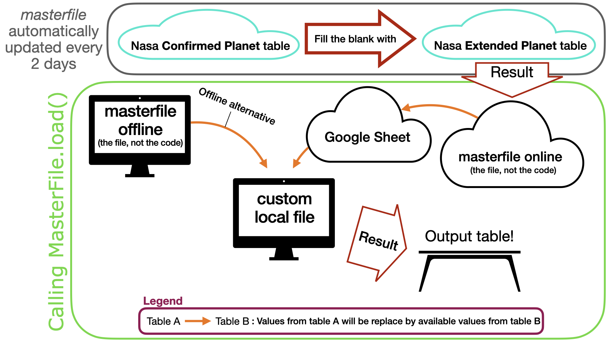

# Tools to generate and access the masterfile

__IMPORTANT__: _masterfile_ is the name of a file and the name of this code (sorry for that). To distinguish between the two in the following text, _masterfile.ecsv_ will be used for the file and ` masterfile ` will be used for the code.

_masterfile.ecsv_ is based on the exoplanet archive tables.
The masterfile and the reference table are available at http://www.astro.umontreal.ca/~adb/

Thanks to for advices and corrections:
--------------
- Merrin Peterson
- Charles Cadieux
- Taylor Bell
- Anne Boucher

_Also thanks to my supervisors,_ David Lafrenière _and_ René Doyon!

Concept
-------
The idea is to make the most complete table as possible.
Here is a scheme of the concept:



Explanations:
1. The [Confirmed Planet Table](https://exoplanetarchive.ipac.caltech.edu/docs/API_exoplanet_columns.html) is used to fill the masterfile.
2. Then, the [Extended Planet Table](https://exoplanetarchive.ipac.caltech.edu/docs/API_exomultpars_columns.html) is used to fill the missing values. The references are sorted according to the error on the orbital period (this could be changed). All the values from a particular reference are used to keep a minimum of consistency.

The resulting file is called _masterfile.ecsv_ and can be used directly. It is also possible to complement this _masterfile.ecsv_ with:

3. a [google sheet](https://docs.google.com/spreadsheets/d/14Trm-AQ2eOphfwqJYrevnDrNVk56E-aH8yvRHQLjzWg/edit?usp=sharing)
4. a local custom table (default is _masterfile_custom.csv_).

To do so, simply use the following code:
``` python
from masterfile.archive import MasterFile
data = MasterFile.load()
```
`data` is an instance of MasterFile which is inheriting from [astropy.table.Table](https://docs.astropy.org/en/stable/table/access_table.html) class (so it has the same behaviour).

Installation
-----
To install `masterfile`, simply clone the Github repository and install the project locally with pip. One simple way to do it is to run the following line in a terminal (you need to be in the directory where you want to copy `masterfile`).
```unix
git clone https://github.com/AntoineDarveau/masterfile.git
cd masterfile
python -m pip install -U pip
python -m pip install -U .
```

You can also install directly from github using `python3 -m pip install -U "git+https://github.com/AntoineDarveau/masterfile.git#egg=masterfile"`.

To install `masterfile` for development, it is recommended to use an isolated environment with a tool like conda, virtualenv or venv. Inside your environment, you can install following the steps above, but replacing `python -m pip install -U .` by `python -m pip install -U -e ".[dev]"`. This will install `masterfile` in editable mode (`-e`) and it will install the development dependencies.

You can then use `masterfile` with `import masterfile`. See the notebook for examples.

Customize
---------
You can change the default parameters file. Take a look at the notebook for examples.
